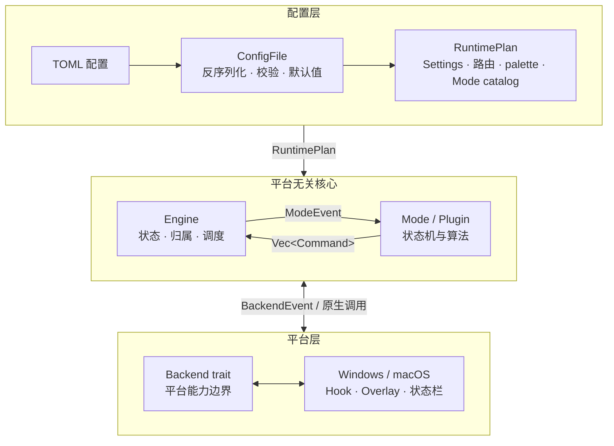
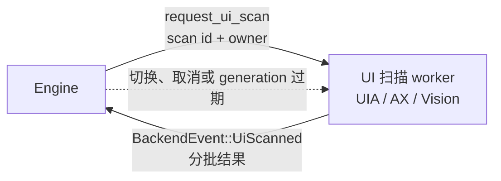

# 架构

KeySteer 是一个单 crate Rust 桌面程序。可以把它理解为一条清晰的流水线：配置决定“按什么键”，Mode 决定“当前怎么处理”，Engine 负责调度，Backend 负责调用 Windows/macOS 原生能力。这样功能可以复用、测试和扩展。

这页给准备读源码或贡献代码的人；只想改快捷键，请先看 [配置文件](/reference/configuration)。

## 架构总览



配置和 `Command` 向平台能力流动；键盘、指针、屏幕、帧时钟及异步扫描结果以 `BackendEvent` 返回 Engine。Mode 始终位于平台无关的一侧，只通过 `ModeEvent` 与 `Command` 和宿主交互。

## 源码分层

| 目录 | 负责什么 | 从哪里开始读 |
| --- | --- | --- |
| `src/api/` | 跨平台公共协议：按键、绑定、命令、事件、覆盖层、插件和后端 trait | `api/mod.rs`、`api/binding.rs`、`api/command.rs` |
| `src/config/` | TOML 反序列化、默认值、校验、主题、继承和可提交 store | `config/mod.rs`、`config/store.rs` |
| `src/app/` | CLI、路径、配置编译、Mode catalog 和启动组装 | `app/bootstrap.rs`、`app/configuration.rs` |
| `src/runtime/` | Engine、RuntimePlan、输入/调度/覆盖层协作者 | `runtime/mod.rs`、`runtime/plan.rs` |
| `src/modes/` | `idle`、`normal`、`grid`、`recursive_grid`、`ui_hint` 状态机 | 对应的 `.rs` 文件 |
| `src/modes/hint/` | UI Hint 私有标签分配、匹配和视觉分层算法 | `labeling.rs`、`matching.rs`、`view.rs` |
| `src/plugins/` | 内置插件；也是插件的参考实现 | `builtin/screen_selector.rs` |
| `src/platform/windows/` | Win32 Hook、SendInput、UIA、覆盖层、帧时钟和托盘 | `mod.rs` |
| `src/platform/macos/` | CGEventTap、Core Graphics、AX、Vision、AppKit 和顶部状态项 | `mod.rs` |

`src/lib.rs` 的常规公开面只保留 `app` 启动入口；其余模块为单 crate 内部边界。`perf-probe`
feature 下额外提供 doc-hidden benchmark hook。`src/main.rs` 只负责进入 CLI 和启动流程。平台后端由 `cfg(target_os)` 在编译期选择。

## 启动流程

`main.rs` 进入 `app::run_cli()` 后，程序依次：

1. 初始化日志和 panic hook。
2. 解析 `--config`、`--check`、`--doctor` 等参数。
3. 显式 `--config` 时加载该文件；否则在应用数据目录按文件名选择第一个 `keysteer.<名称>.toml` 用户配置。没有用户配置时使用内建默认值。
4. 把已验证的 `ConfigFile` 编译成 `RuntimePlan`。
5. 创建目标平台的 `Backend`，并以完整计划创建 `Engine`。
6. 启动事件循环，默认激活 `idle`。

## Engine 是调度中心

`Engine` 不实现具体的网格或 UI 扫描算法，而是维护运行时状态：

- 当前 Mode、临时 Mode 和 modal 操作栈。
- 每个 Mode 编译后的按键表及应用覆盖。
- `InputState` 中的按键 disposition、held gesture、长按与合成输入。
- `Scheduler` 中的非阻塞动作序列、timer 和 frame-clock owner。
- 屏幕、光标、前台应用、主题和覆盖层 scene。

它把 Mode 返回的 `Command` 翻译成 Backend 调用，或再发回一个 ModeEvent。Mode 不需要知道窗口句柄、线程、权限或原生 API。

## Mode 与 Plugin 的统一契约

Mode 是一个平台无关状态机：收到 `ModeEvent` 和只读的 `HostContext`，返回 `CommandBatch`。

```rust
impl Mode for MyMode {
    fn id(&self) -> ModeId { ModeId::new("my_mode").unwrap() }

    fn handle(&mut self, event: &ModeEvent, ctx: &HostContext<'_>) -> CommandBatch {
        // 更新状态，返回宿主可以执行的 Command
        CommandBatch::new()
    }
}
```

Mode 可以请求：移动鼠标、发送按键、显示覆盖层、扫描 UI、切换或压栈模式、设置 timer、执行命令和重载配置。它不能直接调用 `Backend`、`Win32`、`AppKit`、`UIA` 或 `AX`。

插件也可以实现同一个 `Mode` trait，并通过 `Manifest` 声明 id、动词和建议绑定。

## 异步工作

UIA、AX、Vision 扫描在 worker 中执行，以 `BackendEvent::UiScanned` 分批返回；Engine 用 scan id 和 owner 丢弃过期结果。



## 修改时守住的边界

- 新能力先放进 `src/api/` 的平台无关类型，再由 Mode/Engine 使用。
- 不要让 Mode 依赖某个平台的具体类型。
- 修改 `Backend` 时同时检查 Windows、macOS 和 `unsupported` 实现。
- 改动绑定语法时同步更新 `keysteer.default.toml`、配置文档和测试。
- 改动 Finish、点击或 held input 时，重点检查失败清理和 key-up 路由。无效配置重载必须零副作用；有效重载执行完整 runtime restart，同时保留物理 Down/Up disposition 配对。

下一步可阅读 [扩展指南](/development/extension-guide)、[开发流程与测试](/development/workflow) 或 [插件开发](/development/plugin-development)。
