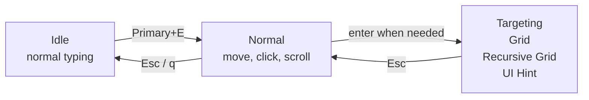

# Getting started

<script setup>
import KeyLayout from '../../.vitepress/components/KeyLayout'
</script>

When KeySteer starts, it quietly waits in the tray or menu bar and does not interfere with normal typing. For your first use, **you do not need to memorise every command or create a configuration file**.

::: tip One simple session
`Primary+E` to start → `h j k l` to move → `;` to click → `Esc` to finish

`Primary` is cross-platform: the shipped setting is left `Alt` on Windows and `Command` on macOS.
:::

## First use

1. Start KeySteer.
2. Press the entry key:

   | Windows | macOS |
   | --- | --- |
   | `Left Alt + E` | `Command + E` |

3. Hold these keys to move the pointer:

   ```text
          K  up
   H  left  J  down  L  right
   ```

4. Press `;` to left-click.
5. Press `Esc` to return to Idle and restore normal keyboard input.

Once you have moved the pointer and clicked once, you know KeySteer's most common workflow.

::: warning No response on your first macOS use?
Grant Accessibility permission first; see [macOS installation and permissions](/en/guide/macos).
:::

## The operating model at a glance



Most of the time you only switch between Idle and Normal. The three targeting modes are optional; there is no need to learn them all at once.

## When the pointer needs to travel farther

| What you want to do | Key | Mode |
| --- | --- | --- |
| Reach an approximate area quickly | `g` | [Grid](/en/modes/grid) |
| Target a very small control precisely | `f` | [Recursive Grid](/en/modes/recursive-grid) |
| Select a button, link, or input directly | `Primary+F` | [UI Hint](/en/modes/ui-hint) |

Press `Esc` in a targeting mode to return to Normal; press it again to return to Idle.

## Everyday controls

<KeyLayout
  layout="q w e r t y u i o p/Caps a s d f g h j k l ; '/Shift z x c v b n m , . Slash RShift/Ctrl Primary Alt Space"
  move="h j k l"
  click="; ' RShift"
  speed="Caps Shift v b"
  scroll="m ,"
  state="n"
  navigation="t y u i"
  mode="e f g q Primary"
  label="Default key layout"
  hint="Learn the colour groups first, then add commands when you need them."
/>

| Key | Action | A way to remember it |
| --- | --- | --- |
| `m` / `,` | Scroll down / up | Scroll from the main key area |
| `Caps Lock` / `Left Shift` | Precision / slow movement | Hold while pressing `h j k l` |
| `v` or `b` | Fast movement | Hold while moving |
| `'` / `Right Shift` | Right / middle click | Next to `;`, the left click |

<details open>
<summary><strong>Show every default key</strong> (read this once you are comfortable)</summary>

| Key | Action |
| --- | --- |
| `h j k l` | Move left, down, up, and right |
| `Caps Lock` / `Left Shift` | Precision / slow mode for movement and scrolling |
| `v` or `b` | Fast mode for movement and scrolling |
| `m` / `,` | Scroll down / up |
| `;` / `'` / `Right Shift` | Left / right / middle click |
| `n` | Toggle a held left button for dragging |
| `t` / `y` / `i` / `u` | Send `Home` / `End` / `Page Up` / `Page Down` |
| `g` / `f` / `Primary+F` | `Grid` / `Recursive Grid` / `UI Hint` |
| `Primary+S` | Switch to the next display |
| `q` or `Esc` | Return to Idle |

</details>

## Want different keys?

Open the [Configuration & Simulator](/en/editor/) to view the keyboard, edit bindings and colours, then download your own TOML. KeySteer does not require a configuration file; start from the [shipped default](/generated/keysteer.default.toml).

`Primary` is a cross-platform name: it defaults to left `Alt` on Windows and `Command` on macOS. Advanced users can map it to another physical key with `[key_aliases]`.

<details>
<summary><strong>Status menu, diagnostics, and configuration locations</strong></summary>

Right-click the tray icon or click the menu-bar icon to pause, reload configuration, send the active configuration to the web simulator, enable launch at login, check for updates, or quit.

Use these commands to inspect a configuration or diagnose the environment:

```bash
keysteer --check -c keysteer.user.toml
keysteer --doctor
keysteer --dump-config
```

- On Windows portable builds, configuration and logs are normally next to the program.
- In a packaged macOS app, they are in `~/Library/Application Support/KeySteer/`.

You can [download](/generated/keysteer.default.toml) the complete default configuration. See [Configuration](/en/reference/configuration) and [Modes and actions](/en/reference/modes-and-actions) for more.

</details>
