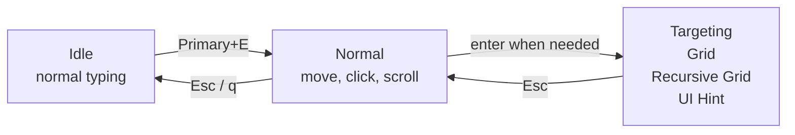
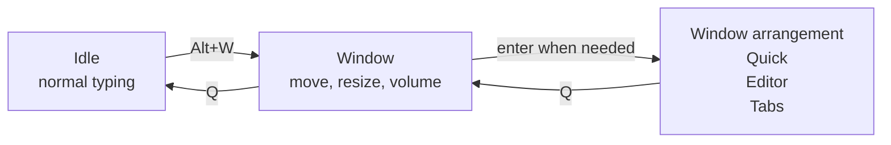

# Getting started

<script setup>
import ModeVideo from '../../.vitepress/components/ModeVideo'
import KeyLayout from '../../.vitepress/components/KeyLayout'
</script>

When KeySteer starts, it quietly waits in the Windows tray or the macOS top status area and does not interfere with normal typing. For your first use, **you do not need to memorise every command or create a configuration file**.

::: tip One simple session
`Primary+E` to start → `h j k l` to move → `;` to click → `Esc` to finish

`Primary` is cross-platform: the shipped setting is left `Alt` on Windows and `Command` on macOS.
:::

## First use

1. Start KeySteer.
2. Press the entry key:

   | Windows | macOS |
   | --- | --- |
   | `Left Alt + E` | `Command + E` |

3. Hold these keys to move the pointer:

   ```text
          K  up
   H  left  J  down  L  right
   ```

4. Press `;` to left-click.
5. Press `Esc` to return to Idle and restore normal keyboard input.

Once you have moved the pointer and clicked once, you know KeySteer's most common workflow.

::: warning No response on your first macOS use?
Grant Accessibility permission first; see [macOS installation and permissions](/en/guide/macos).
:::

## View available keys at any time

Add `"?" = "key_help"` under `[normal.bindings]`, then press `?` (`Shift+/` on a US keyboard) to show the available keys and actions in a rounded panel centered at the bottom of the current screen. Press it again to close the panel. Omit or comment out this binding to disable it.

<ModeVideo file="help.mp4" title="Available key hints" description="Preview the panel, then bind key_help to a key of your choice." />

## Your first window adjustment

<ModeVideo file="window.mp4" title="Your first Window session" description="Move, resize, centre and control audio with the keyboard." />

1. Place the pointer over an ordinary window.
2. Press `Alt+W` (Option+W on macOS), then release the entry keys.
3. Use `H/J/K/L` to move it. Press `S` to switch to centred resizing, then use the same keys.
4. Press `Z` to undo an adjustment, or `Q` to finish and keep it.

Want a split screen? Press `A` from Window, then `H` for the left half. Want to arrange several windows? Press `E`; arrangement takes effect immediately and `Z` undoes it. `T` groups windows into tabs and `R` opens saved presets.

Quick, Editor, Tabs, and Restore use `Q` to return to Window; another `Q` returns to Idle. Hold `Primary` to temporarily use Normal pointer controls.

Follow the [Window guide](/en/window-management/) for side-by-side layouts, tab groups, saved workspaces, audio controls, and a mode-specific key reference.

## Choose your next window task

| Key in Window | What happens | Learn more |
| --- | --- | --- |
| `A` | Choose placement and ratios with direction keys. | [Quick: fast split layouts](/en/window-management/quick) |
| `E` | Tile immediately; swap numbered windows and adjust regions. | [Editor: tile and edit regions](/en/window-management/editor) |
| `T` | Group compatible windows by application. | [Tabs: group windows](/en/window-management/tabs) |
| `R` | Save an arrangement, then fill it with the windows you need today. | [Restore: saved layouts and tab templates](/en/window-management/restore) |

Save from Editor or Tabs with `Ctrl+S` → optional note → `Enter`. An empty note uses an automatic name.

## The operating model at a glance



Most of the time you only switch between Idle and Normal. The three targeting modes are optional; there is no need to learn them all at once.



Window is the starting point for window management. Quick, Editor, and Tabs are optional ways to arrange your windows.

## When the pointer needs to travel farther

| What you want to do | Key | Mode |
| --- | --- | --- |
| Reach an approximate area quickly | `g` | [Grid](/en/modes/grid) |
| Target a very small control precisely | `f` | [Recursive Grid](/en/modes/recursive-grid) |
| Select a button, link, or input directly | `Primary+F` | [UI Hint](/en/modes/ui-hint) |

Press `Esc` in a targeting mode to return to Normal; press it again to return to Idle.

## Everyday controls

<KeyLayout
  layout="q w e r t y u i o p/Caps a s d f g h j k l ; '/Shift z x c v b n m , . Slash RShift/Ctrl Primary Alt Space"
  move="h j k l"
  click="; ' RShift"
  speed="Caps Shift v b"
  scroll="m ,"
  state="n"
  navigation="t y u i"
  mode="e f g q Primary"
  label="Default key layout"
  hint="Learn the colour groups first, then add commands when you need them."
/>

| Key | Action | A way to remember it |
| --- | --- | --- |
| `m` / `,` | Scroll down / up | Scroll from the main key area |
| `Caps Lock` / `Left Shift` | Precision / slow movement | Hold while pressing `h j k l` |
| `v` or `b` | Fast movement | Hold while moving |
| `'` / `Right Shift` | Right / middle click | Next to `;`, the left click |

<details open>
<summary><strong>Show every default key</strong> (read this once you are comfortable)</summary>

| Key | Action |
| --- | --- |
| `h j k l` | Move left, down, up, and right |
| `Caps Lock` / `Left Shift` | Precision / slow mode for movement and scrolling |
| `v` or `b` | Fast mode for movement and scrolling |
| `m` / `,` | Scroll down / up |
| `;` / `'` / `Right Shift` | Left / right / middle click |
| `n` | Toggle a held left button for dragging |
| `t` / `y` / `i` / `u` | Send `Home` / `End` / `Page Up` / `Page Down` |
| `g` / `f` / `Primary+F` | `Grid` / `Recursive Grid` / `UI Hint` |
| `Primary+S` / `Primary+D` | Switch the pointer display / move the window under the pointer to the next display, keeping the pointer's relative position within it |
| `q` or `Esc` | Return to Idle |

</details>

## Want different keys?

Open the [Configuration & Simulator](/en/editor/) to view the keyboard, edit bindings and colours, then download your own TOML. KeySteer does not require a configuration file; start from the [shipped default](/generated/keysteer.default.toml).

`Primary` is a cross-platform name: it defaults to left `Alt` on Windows and `Command` on macOS. Advanced users can map it to another physical key with `[key_aliases]`.

<details>
<summary><strong>Status menu, diagnostics, and configuration locations</strong></summary>

Right-click the Windows tray icon or click the macOS top status icon to pause, reload configuration, send the active configuration to the web simulator, enable launch at login, check for updates, or quit.
Signed Windows releases can install and restart after downloading. KeySteer first verifies that both
versions use the same publisher certificate and restores the previous version if startup fails. Unsigned
development builds and macOS downloads continue to use manual replacement.

Use these commands to inspect a configuration or diagnose the environment:

```bash
keysteer --check -c keysteer.user.toml
keysteer --doctor
keysteer --dump-config
```

- On Windows portable builds, configuration and logs are normally next to the program.
- In a packaged macOS app, they are in `~/Library/Application Support/KeySteer/`.

You can [download](/generated/keysteer.default.toml) the complete default configuration. See [Configuration](/en/reference/configuration) and [Modes and actions](/en/reference/modes-and-actions) for more.

</details>

## Edit bindings in your browser

Open **Configuration & Simulator...** from the tray menu. It opens your browser and requires network access. The simulator is an editor and preview; native app behavior is authoritative.

<ModeVideo file="config.mp4" title="Edit W and A bindings" description="Choose a key on the full keyboard, then choose its action." />
