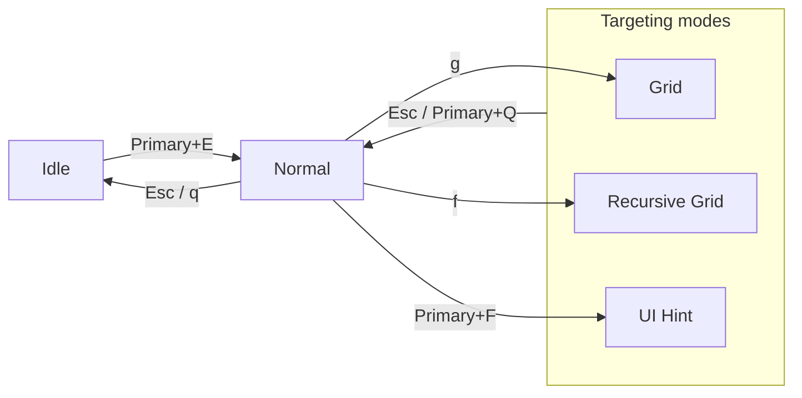

# Modes overview

Think of KeySteer as three operating layers: `Idle` waits quietly, `Normal` handles everyday movement and clicking, and a targeting mode helps you find an exact target.



All three targeting modes return to Normal with `Esc` or `Primary+Q`.

## Which mode should I choose?

| Your goal | Recommended mode | Why |
| --- | --- | --- |
| Move, scroll, click, or drag directly | [Normal](/en/modes/normal) | Best for everyday control. |
| Reach a screen area quickly | [Grid](/en/modes/grid) | Does not rely on application accessibility information. |
| Precisely target a small button or icon | [Recursive Grid](/en/modes/recursive-grid) | Keeps subdividing the current area. |
| Find a button, link, menu, or input | [UI Hint](/en/modes/ui-hint) | Labels controls from the accessibility tree or visual recognition. |

## Idle: quiet waiting

Idle is the startup state. It listens only for entries in `[hotkeys]` and does not intercept normal typing. The usual entry is `Primary+E`: `Command+E` on macOS and `Alt+E` on Windows/Linux unless you override the `Primary` alias.

You can start any Mode directly from Idle:

```toml
[hotkeys]
"primary+e" = "normal"
"primary+g" = "grid"
```

Keep at least one entry key.

## Temporarily use Normal

Grid, Recursive Grid, and UI Hint inherit Normal by default and use `Primary` as a temporary-mode modifier. Hold it to use Normal's movement, scrolling, and click bindings while keeping the current targeting session; release it to resume targeting.

```toml
[grid]
inherits = ["hotkeys", "normal"]
temporary_mode = "normal"
temporary_mode_keys = ["primary"]
```

## End states

Targeting modes have a **finished state** and a **clicked state**:

```toml
[grid.lifecycle]
after_finish = "normal"
after_click = "finish"
```

For either state you can choose:

- `keep`: preserve the current session.
- `restart`: begin it again.
- A Mode name: switch to that Mode, such as `idle` or `normal`.
- A built-in verb such as `left_click`: perform it after completion.

The finished state means no label or character remains to select, common in Grid and UI Hint. The clicked state is entered after a pointer click, common in Recursive Grid. By default, Grid and UI Hint return to Normal after finishing or clicking; Recursive Grid keeps its session.

## Multiple displays

Grid and Recursive Grid target the display containing the pointer by default. The built-in Screen Selector plugin uses `Primary+S` to move to another display and can preserve the current Grid or Recursive Grid path.

## Important

If a high-integrity Windows application rejects synthetic input, such as Task Manager, KeySteer clears its input state and returns to Idle so that no state is left behind.
