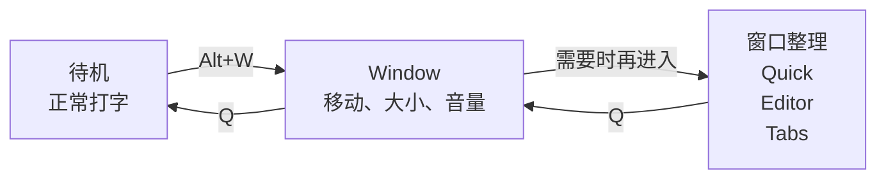

# 快速上手

<script setup>
import ModeVideo from '../.vitepress/components/ModeVideo'
import KeyLayout from '../.vitepress/components/KeyLayout'
</script>

KeySteer 启动后默认安静地待在 Windows 托盘或 macOS 顶部状态栏，不会影响正常打字。第一次使用时，**可以先不去记操作 ，也不需要创建配置文件**。

::: tip 简单的一次启动
`Primary+E` 开始 → `h j k l` 移动 → `;` 点击 → `Esc` 结束

`Primary` 是跨平台名称：发布默认值在 Windows 上是左 `Alt`，在 macOS 上是 `Command`。尽可能保持手感一致
:::

## 第一次使用

1. 启动 KeySteer。
2. 按进入键：

   | Windows | macOS |
   | --- | --- |
   | `左 Alt + E` | `Command + E` |

3. 按住下面四个键移动鼠标：

   ```text
          K  上
   H  左  J  下  L  右
   ```

4. 按 `;` 左键点击。
5. 按 `Esc` 返回待机，键盘恢复正常输入。

看到鼠标移动并完成一次点击，就已经学会 KeySteer 最常用的操作了。

::: warning macOS 第一次没有反应？
需要先授予辅助功能权限，参见 [macOS 安装与授权](/guide/macos)。
:::

## 随时查看可用按键

在 `[normal.bindings]` 中添加 `"?" = "key_help"` 后，按 `?`（Shift+/）在当前屏幕底部居中的圆角面板内展开可用按键和动作，再按一次关闭。省略或注释此绑定即禁用。

<ModeVideo file="help.mp4" title="查看当前快捷键提示" description="先预览提示面板，再给 key_help 配置喜欢的快捷键。" />

## 第一次用键盘调整窗口

<ModeVideo file="window.mp4" title="第一次用 Window 操控窗口" description="跟着视频练习移动、缩放、居中和声音控制。" />

1. 把鼠标放到一个普通窗口上。
2. 按 `Alt+W`（macOS 为 Option+W），然后松开入口键。
3. 用 `H/J/K/L` 移动窗口；按 `S` 切换中心缩放，再用相同方向键调整。
4. 按 `Z` 撤销一次调整，或按 `Q` 结束并保留结果。

想分屏？在 Window 中按 `A`，再按 `H` 放到左半屏。想整理多个窗口？按 `E` 立即自动排列，`Z` 可撤销。`T` 把窗口收成标签组，`R` 打开已保存预设。

Quick、Editor、Tabs、Restore 的 `Q` 返回 Window，再按一次 `Q` 回到待机。按住 `Primary` 可临时使用 Normal 的鼠标操作。

跟着 [Window 操作指南](/window-management/) 练习并排布局、标签分组、保存工作区和音频控制，并按当前模式查阅键位。

## 接着试试窗口管理

| Window 中按 | 会发生什么 | 继续学习 |
| --- | --- | --- |
| `A` | 方向键安排窗口位置与分屏比例。 | [Quick：快捷分屏](/window-management/quick) |
| `E` | 自动平铺，再交换窗口、切分与调整区域。 | [Editor：平铺与区域编辑](/window-management/editor) |
| `T` | 自动整理同应用的兼容窗口，也可自由组合。 | [Tabs：窗口标签分组](/window-management/tabs) |
| `R` | 保存的是空间和分组安排，恢复时用当前需要的窗口填入。 | [Restore：恢复布局与标签模板](/window-management/restore) |

在 Editor 或 Tabs 中按 `Ctrl+S` → 填写备注或留空 → `Enter` 保存；留空时自动生成默认名称。

## 一张图记住工作方式


平时只需在“待机”和 “Normal” 之间切换。三种定位模式是可选的，不需要一开始全部记住。




Window 是窗口管理的基础入口，Quick、Editor 和 Tabs 是按需选用的整理方式。

## 鼠标移动太远时

| 你想做什么 | 按键 | 模式 |
| --- | --- | --- |
| 快速到达屏幕的大致区域 | `g` | [Grid](/modes/grid) |
| 精确定位很小的目标 | `f` | [Recursive Grid](/modes/recursive-grid) |
| 直接选择按钮、链接或输入框 | `Primary+F` | [UI Hint](/modes/ui-hint) |

进入定位模式后按 `Esc` 返回 Normal；再按一次 `Esc` 返回待机。

## 常用操作

<KeyLayout
  layout="q w e r t y u i o p/Caps a s d f g h j k l ; '/Shift z x c v b n m , . Slash RShift/Ctrl Primary Alt Space"
  move="h j k l"
  click="; ' RShift"
  speed="Caps Shift v b"
  scroll="m ,"
  state="n"
  navigation="t y u i"
  mode="e f g q Primary"
  label="常用键位速记"
  hint="先认颜色，再按需记住其他键"
/>

| 按键 | 作用 | 记忆方式 |
| --- | --- | --- |
| `m` / `,` | 向下 / 向上滚动 | 在主键区直接滚动 |
| `Caps Lock` / `左 Shift` | 精确 / 慢速移动 | 按住后再按 `h j k l` |
| `v` 或 `b` | 快速移动 | 按住后再移动 |
| `'` / `右 Shift` | 右键 / 中键点击 | 与 `;` 左键相邻 |

<details open>
<summary><strong>查看完整默认键位</strong>（熟悉以后再看）</summary>

| 按键 | 作用 |
| --- | --- |
| `h j k l` | 左、下、上、右移动 |
| `Caps Lock` / `左 Shift` | 精确 / 慢速模式，对移动和滚动生效 |
| `v` 或 `b` | 快速模式，对移动和滚动生效 |
| `m` / `,` | 向下 / 向上滚动 |
| `;` / `'` / `右 Shift` | 左键 / 右键 / 中键点击 |
| `n` | 切换左键持续按下，用于拖拽 |
| `t` / `y` / `i` / `u` | 发送 `Home` / `End` / `Page Up` / `Page Down` |
| `g` / `f` / `Primary+F` | `Grid` / `Recursive Grid` / `UI Hint` |
| `Primary+S` / `Primary+D` | 切换鼠标到下一块显示器／将鼠标下窗口移到下一块显示器，鼠标保持在窗口内的相对位置 |
| `q` 或 `Esc` | 返回`Idle`待机 |

</details>

## 按键不顺手？

打开 [配置与模拟器](/editor/) 直接查看键盘、修改绑定和颜色，然后下载自己的 TOML。KeySteer 不依赖配置文件；建议在 [默认文件](/generated/keysteer.default.toml) 的基础之上修改。

`Primary` 是跨平台名称：发布默认值在 Windows 上是左 `Alt`，在 macOS 上是 `Command`。高级用户可以通过 `[key_aliases]` 改成其他实体键。

<details>
<summary><strong>状态栏、诊断和配置位置</strong></summary>

右键 Windows 托盘图标或点击 macOS 顶部状态图标，可以暂停、重载配置、把当前配置直接带入网页模拟器、设置开机启动、检查更新或退出。

需要检查配置或诊断环境时运行：

```bash
keysteer --check -c keysteer.user.toml
keysteer --doctor
keysteer --dump-config
```

- Windows 便携版的配置和日志通常在程序旁边。
- macOS `.app` 的配置和日志在 `~/Library/Application Support/KeySteer/`。

完整默认配置可 [下载](/generated/keysteer.default.toml)。更多内容见 [配置文件](/reference/configuration) 和 [模式与动作](/reference/modes-and-actions)。

</details>

## 在浏览器里图形化改键

从托盘右键菜单打开 **Configuration & Simulator...**，跳转浏览器（注意网络连接）。模拟器供编辑和预览，实际行为以程序为准。

<ModeVideo file="config.mp4" title="修改 W、A 按键绑定" description="点击完整键盘中的按键，再选择动作。" />
