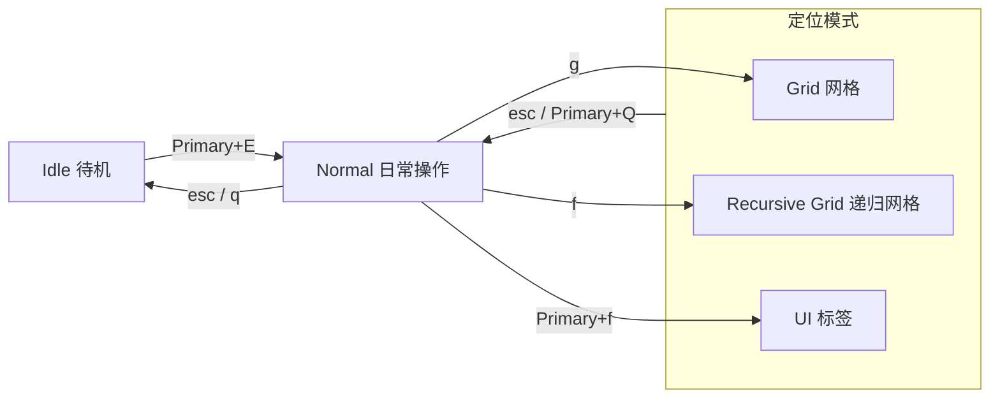

# 模式总览

把 KeySteer 想成三层操作：`Idle` 安静等待，`Normal` 负责日常移动和点击，需要找准目标时再进入一种定位模式。



三个定位模式都可以按 `Esc` 或 `Primary+Q` 回到 Normal。

## 选哪个模式？

| 你的目标                   | 推荐模式                                | 特点                                       |
| -------------------------- | --------------------------------------- | ------------------------------------------ |
| 直接移动、滚动、点击、拖拽 | [Normal](/modes/normal)                 | 适合日常操作。                           |
| 快速到达屏幕某个区域       | [Grid](/modes/grid)                     | 不依赖应用无障碍信息 |
| 精确到细小按钮或图标       | [Recursive Grid](/modes/recursive-grid) | 在当前区域反复细分           |
| 找按钮、链接、菜单、输入框 | [UI Hint](/modes/ui-hint)               | 根据可访问性树或`视觉识别(macOS)`显示标签|

## Idle：安静待机

Idle 是启动时的默认状态，只监听 `[hotkeys]` 中的入口，不会拦截普通文字输入。通常入口是 `Primary+E`：macOS 为 `Command+E`，Windows/Linux 为 `Alt`；如果配置覆盖了 `Primary` 别名，则以你的配置为准。

可以从 Idle 直接启动任意 Mode：

```toml
[hotkeys]
"primary+e" = "normal"
"primary+g" = "grid"
```

建议至少保留一个入口键。

## 临时使用 Normal

Grid、Recursive Grid 和 UI Hint 默认继承 Normal，并把 `Primary` 作为临时修饰键。按住它时，移动、滚动和点击按键临时交给 Normal，方便定位时也能自由移动；松开后回到当前定位会话。

```toml
[grid]
inherits = ["hotkeys", "normal"]
temporary_mode = "normal"
temporary_mode_keys = ["primary"]
```

## 模式结束状态

定位 `Mode` 有两个特别的状态：`完成态`，`点击态`：

```toml
[grid.lifecycle]
after_finish = "normal"
after_click = "finish"
```

after_finish 可配置
- `keep`：保留状态。
- `restart`：重新开始。
- `Mode` 名：切换到指定 Mode。
- `任意内置verb`： 比如`left_click`：实现完成后直接进行点击，不需要确认。

`完成态` 指的是 定位完成后再无便签或字母可选的状态，一般在 `Grid` 或 `UI Hint` 中常见。

`点击态` 指的是 进入状态后鼠标任意点击后进入的状态，一般在 `Recursive Grid` 中常见。

默认行为：

`UI Hint`，`Grid` 完成或点击后回 `Normal`

`Recursive Grid` 完成或点击后保留会话。

## 多显示器和恢复

`Grid` 与 `Recursive Grid` 默认定位鼠标所在的显示器。Screen Selector 可以切换到其他显示器，并可选择保留当前定位路径。

## 特别注意

如果 Windows 高权限窗口拒绝合成输入，比如**任务管理器**，KeySteer 会清理输入，退回到 Idle，避免留下无法继续的状态。
